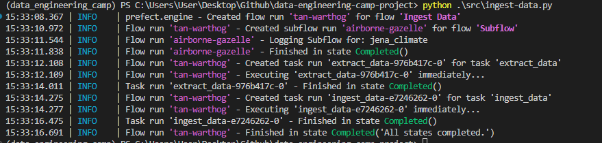
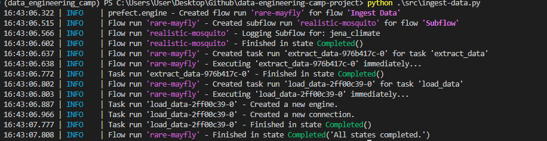
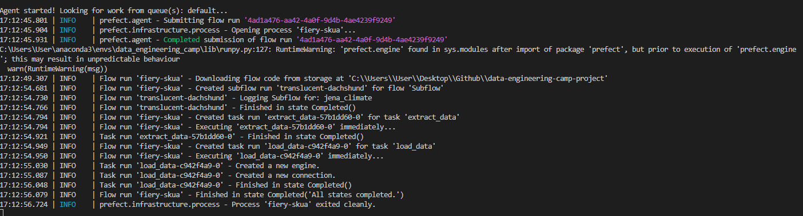
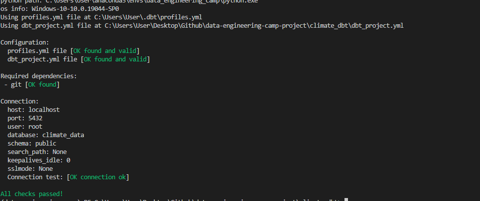
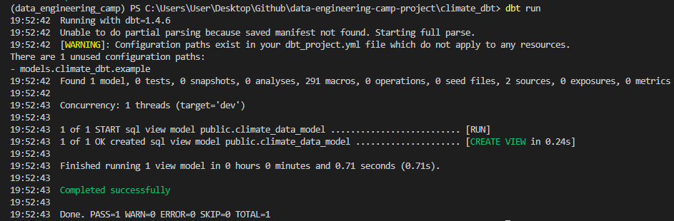
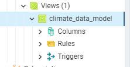

# Final Project for the Data Engineering Zoomcamp hosted by DataTalksClub.
## Dataset
First at all, I'll work with a batch pipeline (the data will be updated day by day). I was looking for some climate data and I've chosen this [one](https://www.kaggle.com/datasets/mnassrib/jena-climate?resource=download).
## Pipeline diagram
## Technologies
- Python
- GCP (Google Cloud Plattform)
- Prefect
- DBT
- Google Data Studio or Looker
- Terraform
### What is Terraform?
- Terraform is an open-source infrastructure as code software tool created by HashiCorp. Users define and provide data center infrastructure using a declarative configuration language known as HashiCorp Configuration Language, or optionally JSON.
### Create a project in GCP
- Create a project in GCP
- I will called it `dtc-de`
- Go to IAM and create a service account (assign the viewer role)
- Create a key for the account service

### Install Google Cloud SDK
Follow the instructions from [here](https://cloud.google.com/sdk/docs/install?hl=en-419)
### Make sure that all is working well using the command 
```sh
gcloud -v
```
### Add Rol to your service account
- Storage Admin
- Storage Object Admin
- Big Query Admin

### Look for API's and enable `IAM Service Account Credentials API`

### Refresh service-account's auth-token for this season
```sh
gcloud auth application-default login
```
### Creating GCP Infrastucture with Terraform
Watch more [here](https://www.youtube.com/watch?v=dNkEgO-CExg&t=5s)
### Initialize state file (.tfstate)
terraform init

### Check changes to new infra plan
terraform plan -var="project=<your-gcp-project-id>"

## Terraform files
### main.tf
```terraform
  terraform {
    required_version = ">= 1.0"
    backend "local" {}  # Can change from "local" to "gcs" (for google) or "s3" (for aws), if you would like to preserve your tf-state online
    required_providers {
      google = {
        source  = "hashicorp/google"
      }
    }
  }
```
We have to specified the required_version. Backend "local" means that we'll save our configuration in a tf-state file in our local computer.

We define a provider here:
```terraform
  provider "google" {
    project = var.project
    region  = var.region
    zone    = var.zone
  }
```
And then a resource, in this case we'll use a storage bucket
```terraform
  resource "google_storage_bucket" "bucket" {
    name          = "dtc-de-bucket"
    location      = var.region
    storage_class = "REGIONAL"
    force_destroy = true
  }
```
### variables.tf
This file contains all the variables that we'll use in our main.tf file
```terraform
  variable "project" {
    type        = string
    description = "The GCP project to use for integration tests"
  }
  variable "region" {
    type        = string
    description = "The GCP region to use for integration tests"
    default     = "us-central1"
  }
  variable "zone" {
    type        = string
    description = "The GCP zone to use for integration tests"
    default     = "us-central1-a"
  }
```
## Overview of terraform commands
- terraform init
- terraform plan
- terraform apply
- terraform destroy

## Terraform commands
### Initialize state file (.tfstate)
```sh
terraform init
```
### Check changes to new infra plan
```sh
terraform plan -var="project=<your-gcp-project-id>"
```
### Apply changes to new infra
```sh
terraform apply -var="project=<your-gcp-project-id>"
```
### Destroy changes to new infra
```sh
terraform destroy -var="project=<your-gcp-project-id>"
```
# Problem Description

## Local
## Insertion trough docker.
I'll create a script that upload the data in postgres (this postgres db will be created using docker)
### Docker-compose
Compose is a tool for defining and running multi-container Docker applications. With Compose, you use a YAML file to configure your application’s services. Then, with a single command, you create and start all the services from your configuration.

[More info](https://docs.docker.com/compose/)

### Docker-compose file
[path](src/docker-compose.yaml)

In this docker-compose file we have two images, one of them is for postgres and the other is for pgadmin.

In order to have these images, you need to install them.

### Install postgres
```sh
docker pull postgres
```
### Install pgadmin
```sh
docker pull dpage/pgadmin4
```
### Make sure that you have both of them
```sh
docker images
```

### Run docker-compose
```sh
docker-compose up -d
```
### Check if the containers are running
```sh
docker ps
```
### Stop docker-compose
```sh
docker-compose down
```

## Dockerfile
This dockerfile will upload the data directly from url to postgres (using docker-compose file to create postgres db).
### Build image
```sh
docker build -t climate_ingest:v001 .
```
### Run the image
```sh
docker run climate_ingest:v001 `
      --user=root `
      --password=root `
      --host=pgdatabase `
      --port=5432 `
      --db=climate_data `
      --table_name=jena_climate `
      --url='https://test-esteban-270101.s3.us-east-1.amazonaws.com/jena_climate_2009_2016.csv'
```
Directly using python

```python 
python src/upload-data.py `
      --user=root `
      --password=root `
      --host=localhost `
      --port=5432 `
      --db=climate_data `
      --table_name=jena_climate `
      --url='https://test-esteban-270101.s3.us-east-1.amazonaws.com/jena_climate_2009_2016.csv' 
```

Now we have the data inside the db.
# Orchestration
## Prefect
I'll use prefect==2.7.7
### Install prefect
```sh
pip install prefect==2.7.7
```
### Python script
In order to use prefect. I'll create a script called `ingest-data.py`.

[**Path**](src/ingest-data.py)

Basically, in this script I have created some flows and tasks in order to transform the data and ingest it to postgres (docker-compose file).

### Run the script
```sh
python src/ingest-data.py
```

## Prefect UI
### Start the UI
```sh
prefect orion start
```
## Create a sql alchemy block
Import the connector
```python
from prefect_sqlalchemy import SqlAlchemyConnector
```
Now follow these steps:
- Select a block name
- Select SyncDriver and choose `postgresql + psycopg2`
- Put the db name
- Insert the username, password, host and the port.

Call the block in the code:
```python
@task(log_prints = True, retries = 3)
def load_data(table_name, df):
    connection_block = SqlAlchemyConnector.load("data-engineering-camp-postgres-connector")
    with connection_block.get_connection(begin = False) as engine:
        df.head(n=0).to_sql(name=table_name, con=engine, if_exists='replace')
        df.to_sql(name=table_name, con=engine, if_exists='append')
```
### Run the script again
```sh
python src/ingest-data.py
```



## Build a deployment
```
prefect deployment build ./src/ingest-data.py:main_flow -n "Ingest Data ETL"
```
## Apply the deployment
```
prefect deployment apply main_flow-deployment.yaml
```
## Start an agent using default Work Queue
```
prefect agent start -q 'default'
```

Go to the UI and click "Quick Run" to your deployment, after that you can start the agent. Your workflow should run.



You can schedule this deployment. For instance, you can use cronjobs or intervals.
# Data Warehousing
## Clustering and partitioning the data

In this case our data which is defined as jena climate could be partitioned by date. We don't have another categorical variable for clustering.

### Create a partitioned table in postgres
```sql
CREATE TABLE jena_climate_partitioned (
    index bigint,
    date_time date,
    "p (mbar)" float,
    "T (degC)" float,
    "Tpot (K)" float,
    "Tdew (degC)" float,
    "rh (%)" float,
    "VPmax (mbar)" float,
    "VPact (mbar)" float,
    "VPdef (mbar)" float,
    "sh (g/kg)" float,
    "H2OC (mmol/mol)" float,
    "rho (g/m**3)" float,
    "wv (m/s)" float,
    "max. wv (m/s)" float,
    "wd (deg)" float
) PARTITION BY RANGE (date_time);
```
Next, you can create the partitions themselves using the CREATE TABLE ... PARTITION OF statement. This statement creates a new child table that is a partition of the parent partitioned table.
```
CREATE TABLE jena_climate_partitioned_2009_2016
PARTITION OF jena_climate_partitioned
FOR VALUES FROM ('2009-01-01') TO ('2016-12-31');
```
### Insert the data there
```sql
INSERT INTO jena_climate_partitioned
SELECT * FROM jena_climate;
```

## Create a new flow to create the partitioned table 
```python
@task(log_prints = True, retries = 3)
def create_partitioned_table(table_name):
    connection_block = SqlAlchemyConnector.load("data-engineering-camp-postgres-connector")
    with connection_block.get_connection(begin = False) as engine:
        engine.execute(f"CREATE TABLE {table_name} ("
                       "index bigint,"
                       "date_time date,"
                       "\"p (mbar)\" float,"
                       "\"T (degC)\" float,"
                       "\"Tpot (K)\" float,"
                       "\"Tdew (degC)\" float,"
                       "\"rh (%)\" float,"
                       "\"VPmax (mbar)\" float,"
                       "\"VPact (mbar)\" float,"
                       "\"VPdef (mbar)\" float,"
                       "\"sh (g/kg)\" float,"
                       "\"H2OC (mmol/mol)\" float,"
                       "\"rho (g/m**3)\" float,"
                       "\"wv (m/s)\" float,"
                       "\"max. wv (m/s)\" float,"
                       "\"wd (deg)\" float"
                       ") PARTITION BY RANGE (date_time);")
    ## Create child partitioned table
    with connection_block.get_connection(begin = False) as engine:
        engine.execute(f"CREATE TABLE {table_name}_2009_2016 "
                       f"PARTITION OF {table_name} "
                       "FOR VALUES FROM ('2009-01-01') TO ('2016-12-31');")
    ## Insert the data from original table to the partitioned data
    with connection_block.get_connection(begin = False) as engine:
        engine.execute(f"INSERT INTO {table_name} "
                       f"SELECT * FROM jena_climate;")
```
# DBT 
## Install DBT
```sh
pip install dbt-postgres==1.4.6
```
## Create a dbt project called climate_dbt
```sh
dbt init climate_dbt
```
## Edit the file profiles.yml
Use the following command to access to the file
```sh
code ~/.dbt/profiles.yml
```
Add the following code:
```yml
climate_dbt:
  target: dev
  outputs:
    dev:
      type: postgres
      threads: 1
      host: localhost
      port: 5432
      user: root
      pass: root
      dbname: climate_data
      schema: public
```
## Test connections
```sh
dbt debug 
```


## Create a model
I'll create a model called `climate_data_model.sql`. Before this you should create an schema a and define your tables and databases, for example:
```yml
version: 2

sources:
  - name: staging
    database: climate_data
    schema: public

    tables:
      - name: jena_climate
      - name: jena_climate_partitioned
```

Then you should be able to create your dbt model. For intance, could be something like this:
```sql
{{ config(materialized='table') }}
select * from climate_data.jena_climate
```
## Run the model
```sh
dbt run
```


Now go to your pgadmin and see if the view was created.



## Dbt tests
You can create tests for your models. For instance, you can test if the model has the same number of columns that the source table. You can create a file called `schema.yml` in the `models` folder. Then you can add the following code:
```yml
models:
    - name: climate_data_model
      description: >
        View that collects all the data from a the partitioned table.
      columns:
        - name: index
          description: Index of the table.
          tests:
            - unique:
                severity: warn
            - not_null:
                severity: warn
        - name: date_time
          description: Date of the record.
          tests:
            - unique:
                severity: warn
            - not_null:
                severity: warn
        - name: p (mbar)
          description: Pressure in mbar.
          tests:
            - unique:
                severity: warn
            - not_null:
                severity: warn
        - name: T (degC)  
          description: Temperature in Celsius.
          tests:
            - unique:
                severity: warn
            - not_null:
                severity: warn
        - name: Tpot (K)
          description: Temperature in Kelvin.
          tests:
            - unique:
                severity: warn
            - not_null:
                severity: warn
        - name: Tdew (degC)   
          description: Temperature in Celsius.
          tests:
            - unique:
                severity: warn
            - not_null:
                severity: warn  
        - name: rh (%)  
          description: Relative humidity in percentage.
          tests:
            - unique:
                severity: warn
            - not_null:
                severity: warn
        - name: VPmax (mbar)  
          description: Maximum water vapor pressure in mbar.
          tests:
            - unique:
                severity: warn
            - not_null:
                severity: warn
        - name: VPact (mbar)  
          description: Actual water vapor pressure in mbar.
          tests:
            - unique:
                severity: warn
            - not_null:
                severity: warn
        - name: VPdef (mbar)  
          description: Water vapor pressure deficit in mbar.
          tests:
            - unique:
                severity: warn
            - not_null:
                severity: warn
        - name: sh (g/kg) 
          description: Specific humidity in g/kg.
          tests:
            - unique:
                severity: warn
            - not_null:
                severity: warn
        - name: H2OC (mmol/mol)
          description: Water vapor concentration in mmol/mol.
          tests:
            - unique:
                severity: warn
            - not_null:
                severity: warn
        - name: rho (g/m**3)
          description: Air density in g/m**3.
          tests:
            - unique:
                severity: warn
            - not_null:
                severity: warn
        - name: wv (m/s)  
          description: Wind velocity in m/s.
          tests:
            - unique:
                severity: warn
            - not_null:
                severity: warn
        - name: max. wv (m/s)
          description: Maximum wind velocity in m/s.
          tests:
            - unique:
                severity: warn
            - not_null:
                severity: warn
        - name: wd (deg)  
          description: Wind direction in degrees.
          tests:
            - unique:
                severity: warn
            - not_null:
                severity: warn
```

Then you can run the tests with the following command:
```sh
dbt test
```